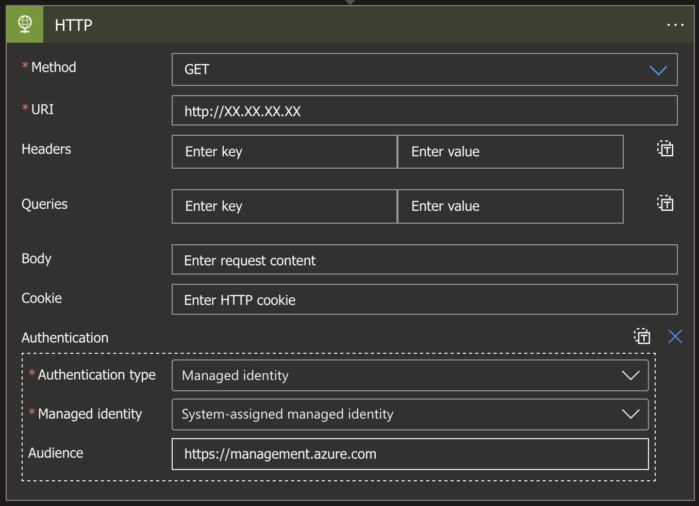

# Service Principals

Service principals are AAD identities that represent applications and services leveraging AAD and Azure resources. There are actually three different types of service principals:
- Application Registration: this identity is the *local* representation of an application which can be used to manage access to an application as well as manage the access that the application has.
- Managed Identity: these identities allow Azure resources to authenticate with AAD without requiring management of authentication material.
- Legacy: these are a legacy form or service principals that (hopefully) aren't in use much nowadays.

We'll take a look into Application Registrations and Managed Identities below.

## Application Registrations

As noted above, these are the *local* representation of an application. But what do we actually mean by this? 

Well if we think about an application in Azure AD, we've got those that are internally developed by an organisation, but also those that are available as multi-tenant applications from a third party. Think any SaaS service that you may want to integrate with AAD. These applications are represented by objects in both the **home** (application publisher) tenant and the **local** (application consumer) tenant:

- **Home tenant**: An **application object** representing the application which will be managed by the application publisher. This represents the resources that the application may need to access, the supported authentication mechanisms and allows for management of access to the APIs exposed by the application.
- **Local tenant**: A **service principal** (application registration) representing the application created in order to manage application access and permissions. This is created with properties derived from the application object.

For internally developed applications, the home tenant and local tenant are one and the same and so both the application object and the application registration exist within the same tenant.

## Managed Identities

Managed identities are a mechanism to simplify identity management for Azure resources. Essentially you can associate an identity with an Azure resource to allow it to retrieve access tokens from AAD without needing to manage authentication material for the resource. So, no management of client secrets or certificates to access resources.

There are two types of managed identities:
- System assigned: These are associated to one specific Azure resource and thus follow their lifecycle. If an Azure resource is deleted, then any associated system assigned managed identities are also deleted. 
- User assigned: Managed identities can also be separately created without being tied to a specific resource. These can be associated with any number of resources and do not follow the lifecycle of any specific resource.

A list of Azure resources supporting managed identities can be found in the Microsoft documentation [here](https://learn.microsoft.com/en-us/azure/active-directory/managed-identities-azure-resources/managed-identities-status).
### Retrieving Access Token

Managed identities do have some specific properties that make them interesting from a security perspective. If the associated resource is compromised, it may be possible to retrieve access tokens for the managed identity. As managed identities remove the need to manage service principal credential material, that removes the need for an attacker to worry about credentials if they've compromised a relevant resource. Dependant on the resource, the method to get an access token differs. A few of these methods have been outlined below, however they may not be exhaustive.
#### Instance Metadata Service

A number of resource types can call the Instance Metadata Service (IMDS) for a token:
`http://169.254.169.254/metadata/identity/oauth2/token?api-version=2018-02-01`.
Using PowerShell to get an access token for Azure Resource Manager (ARM) could look something like this:
```powershell
$resourceUri = "https://management.azure.com/"
$tokenArgs = @{
  Method  = "Get"
  Headers = @{
    "Metadata" = "true"
  }
  Uri     = "http://169.254.169.254/metadata/identity/oauth2/token?resource=$resourceUri&api-version=2018-02-01"
}
$accessToken = (Invoke-RestMethod @tokenArgs).access_token
```
The services that can use this method are as follows:
- Virtual Machine
- Batch
- Container Instance
- DevTest Lab
- Spring App

#### Local REST API

A number of services, however, expose a local REST API for retrieving tokens. The address of this API is stored in an environment variable called `IDENTITY_ENDPOINT`. Additionally, calling this endpoint normally requires a secret to be provided within the `X-IDENTITY-HEADER` HTTP header. The secret required is available through the `IDENTITY_HEADER` environment variable. So using PowerShell to get an access token for ARM would be something like this:
```powershell
$resourceUri = "https://management.azure.com/"
$tokenArgs = @{
  Method  = "Get"
  Headers = @{
    "X-IDENTITY-HEADER" = "$env:IDENTITY_HEADER"
    "Metadata" = "true"
  }
  Uri     = "$env:IDENTITY_ENDPOINT?resource=$resourceUri&api-version=2019-08-01"
}
$accessToken = (Invoke-RestMethod @tokenArgs).access_token
```
The services that can leverage this method are as follows:
- App Service
- Automation
- Container Apps

Arc-enabled servers follow a similar method, however they do not require the `X-IDENTITY-HEADER` HTTP header. Additionally they use api version `2020-06-01` instead.

#### Alternative methods

Then there are a few services that you need to get a little more creative to retrieve tokens from. Let's take Logic Apps as an example. These cannot be used to run arbitrary code to retrieve an access token for a managed identity. However, you *can* make use of some of the available actions to retrieve a token nonetheless. One of [connectors that supports managed identities](https://learn.microsoft.com/en-us/azure/logic-apps/create-managed-service-identity?#where-you-can-use-a-managed-identity) is the built-in HTTP connector. Using this, we could trigger an HTTP request to an HTTP server that we control, with authentication configured to use the managed identity as shown below.


This would result in an HTTP GET request being made against the server with an access token for `https://management.azure.com` included as a bearer token within the `Authorization` header. A redacted example of this request would be as follows:

```http
GET / HTTP/1.1

[[REDACTED]]
Authorization: Bearer eyJ0eXA[[REDACTED]]
```


