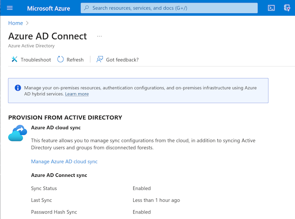
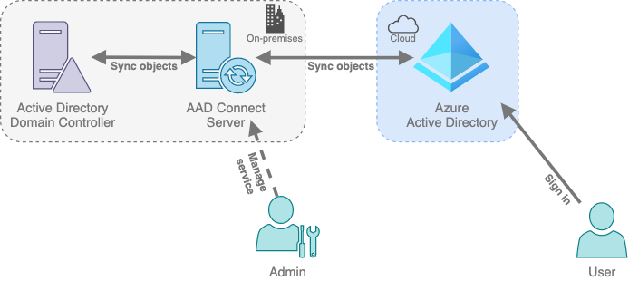
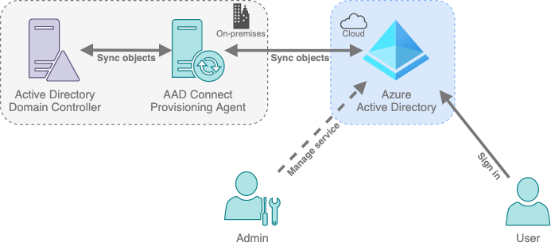

import Tabs from '@theme/Tabs';
import TabItem from '@theme/TabItem';

# Users and Groups

Of course AAD needs to provide some way of managing Users and Groups. There are a couple of ways in which these objects can exist in AAD:
- **Cloud Identity**: These accounts only exist in AAD, they have been created in cloud and are managed here.
- **Hybrid Identity**: These accounts have been synchronised from an on-premise Active Directory and are primarily managed there. We'll go in depth into this later.

## Hybrid Identities

[Hybrid identities](https://learn.microsoft.com/en-us/azure/active-directory/hybrid/whatis-hybrid-identity) simplify identity management by providing a common identity across cloud and on-premise resources. For Azure AD, this is done by synchronising identities and objects with on-premise AD. This is typically achieved using a tool called [Azure AD Connect](https://learn.microsoft.com/en-us/azure/active-directory/hybrid/whatis-azure-ad-connect) or through the cloud managed solution [Azure AD Connect Cloud Sync](https://learn.microsoft.com/en-us/azure/active-directory/cloud-sync/what-is-cloud-sync).
AAD Connect supports the following capabilities:
- [**Object Sync**](https://learn.microsoft.com/en-us/azure/active-directory/hybrid/how-to-connect-sync-whatis): Synchronise users, groups, other objects and their attributes from on-premise AD to AAD.
- [**Device Writeback**](https://learn.microsoft.com/en-us/azure/active-directory/hybrid/how-to-connect-device-writeback): Synchronise AAD joined and registered devices back to on-premise AD. This is required when using features such as Windows Hello for Business in a hybrid cert trust deployment, or to support device controls in Conditional Access policies for ADFS integrated applications (requires AAD P1).
- [**Group Writeback**](https://learn.microsoft.com/en-us/azure/active-directory/hybrid/how-to-connect-group-writeback-v2): Synchronise cloud groups from AAD back to on-premise AD allowing for management in the cloud.
- [**Various Authentication Methods**](#authentication-methods): Support authentication through Password Hash Sync, Pass Through Authentication or Federation. We'll go more in depth into those shortly.
- [**Health Monitoring**](https://learn.microsoft.com/en-us/azure/active-directory/hybrid/whatis-azure-ad-connect#what-is-azure-ad-connect-health): Centralised monitoring for directory synchronisation (requires AAD P1).

Cloud Sync has similar capabilities, with the following caveats:
- Cannot sync device objects either direction.
- Does not support group or hybrid Exchange writeback.
- Does not support directory extension attributes or advanced attribute customisation.
- No cross domain user merging.
- Cannot filter on attribute values.
- Does not support AAD DS.
- Limit on number of objects in groups and in the domain.

Additionally, Cloud Sync does not support Pass Through Authentication. However, Cloud Sync does offer the following benefits:
- Sync disconnected multi-forest AD deployments to AAD.
- High availability provisioning agent deployment which supports high availability password hash synchronisation.

To check the configuration of AAD connect, you can use the following methods. Bear in mind that the Graph API only exposes password sync status on the beta API.
<Tabs>
  <TabItem value="posh_graph" label="Microsoft.Graph PowerShell" default>

```powershell title="Query"
Get-MgOrganization | Select-Object DisplayName,Id,OnPremisesSyncEnabled,OnPremisesLastSyncDateTime
```

```powershell title="Response"
DisplayName Id                                   OnPremisesSyncEnabled OnPremisesLastSyncDateTime
----------- --                                   --------------------- --------------------------
3hbnh5      b93319e6-xxxx-xxxx-xxxx-xxxxxxxxxxxx                  True 9/19/2022 6:03:40 PM
```

  </TabItem>
  <TabItem value="posh_graph_beta" label="Microsoft.Graph PowerShell (beta)" default>

```powershell title="Query"
Get-MgOrganization | Select-Object DisplayName,Id,OnPremisesSyncEnabled,OnPremisesLastSyncDateTime,{$_.AdditionalProperties["onPremisesLastPasswordSyncDateTime"]}
```

```powershell title="Response"
DisplayName                                                   : 3hbnh5
Id                                                            : b93319e6-xxxx-xxxx-xxxx-xxxxxxxxxxxx
OnPremisesSyncEnabled                                         : True
OnPremisesLastSyncDateTime                                    : 9/19/2022 6:03:40 PM
$_.AdditionalProperties["onPremisesLastPasswordSyncDateTime"] : 2022-09-19T18:02:10Z
```

  </TabItem>
  <TabItem value="graph" label="Graph API" default>

```http title="Query"
GET https://graph.microsoft.com/v1.0/organization
```

```json title="Response"
{
  "@odata.context": "https://graph.microsoft.com/v1.0/$metadata#organization",
  "value": [
    {
      "id": "b93319e6-xxxx-xxxx-xxxx-xxxxxxxxxxxx",
      [[REDACTED]]
      "displayName": "3hbnh5",
      [[REDACTED]]
      "onPremisesLastSyncDateTime": "9/19/2022 6:03:40 PM",
      "onPremisesSyncEnabled": True,
      [[REDACTED]]
    }
  ]
}
```

  </TabItem>
  <TabItem value="graph_beta" label="Graph API (beta)" default>

```http title="Query"
GET https://graph.microsoft.com/beta/organization
```

```json title="Response"
{
  "@odata.context": "https://graph.microsoft.com/beta/$metadata#organization",
  "value": [
    {
      "id": "b93319e6-xxxx-xxxx-xxxx-xxxxxxxxxxxx",
      [[REDACTED]]
      "displayName": "3hbnh5",
      [[REDACTED]]
      "onPremisesLastPasswordSyncDateTime": "2022-09-19T18:02:10Z",
      "onPremisesLastSyncDateTime": "9/19/2022 6:03:40 PM",
      "onPremisesSyncEnabled": True,
      [[REDACTED]]
    }
  ]
}
```

  </TabItem>
  <TabItem value="portal" label="Portal" default>

  https://portal.azure.com/#view/Microsoft_AAD_IAM/DirectoriesADConnectBlade

  
   
  </TabItem>
</Tabs>

Annoyingly, it doesn't seem possible to check more of the AAD Connect configuration from the Graph API, so to check features enabled on AAD Connect, you can use the [ADSyncTools PowerShell module](https://learn.microsoft.com/en-us/azure/active-directory/hybrid/reference-connect-adsynctools) on the AAD Connect server.

<Tabs>
  <TabItem value="posh_aadc" label="ADSyncTools PowerShell" default>

```powershell title="Query"
Get-ADSyncAADCompanyFeature
```
```powershell title="Response"
PasswordHashSync           : True
ForcePasswordChangeOnLogOn : False
UserWriteback              : False
DeviceWriteback            : False
UnifiedGroupWriteback      : False
GroupWritebackV2           : False
```

  </TabItem>
</Tabs>


### Service Architecture

There are various different topologies supported for AAD Connect, dependent on the number of forests, AAD Tenants and how resources are shared between them.

The high-level architecture of a single forest AAD Connect deployment is as follows:



And for Cloud Sync:



### Authentication Methods
Some of the key benefits of hybrid identities lie within the various authentication methods that are available. Hybrid identities support three different authentication methods:
- [**Password Hash Sync (PHS):**](https://learn.microsoft.com/en-us/azure/active-directory/hybrid/whatis-phs) Authentication is handled in the cloud. Password hashes are synchronised from on-premise AD to AAD. This is the lowest effort configuration to setup. PHS allows for services such as AAD Identity Protection leaked credential detection to be leveraged (requires AAD P2) and so is often enabled alongside one of the other methods. One caveat of this method is that it does not immediately enforce changes in on-premise account states such as account disablement; manually running a sync can avoid this limitation. PHS is highly available as it does not rely on a connection back to on-premise to handle authentication, as such, it can be used as a failover for Pass Through Authentication.
- [**Pass Through Authentication (PTA)**](https://learn.microsoft.com/en-us/azure/active-directory/hybrid/how-to-connect-pta)(not supported when using Cloud Sync): Authentication is handled on-premise by Active Directory and so this method relies on an active connection from AAD back to on-premise AD, however, as noted above, PTA can failover to PHS. One particular benefit of this method is that on-premise account state changes such as account disablement take effect immediately as the authentication is being handled by on-premise AD. PTA works using an agent seperate to the AAD Connect tool. This agent can be installed on multiple hosts to provide high availability.
- [**Federation**](https://learn.microsoft.com/en-us/azure/active-directory/hybrid/how-to-connect-sync-whatis): Authentication is handled by a federation service such as through integration with on-premise Active Directory Federation Services (ADFS). Authentication using this method relies on an active connection from AAD back to the federation service. This method can facilitate advanced authentication methods such as third party MFA, or smartcard authentication.

Each of these authentication methods support [Password Writeback](https://learn.microsoft.com/en-us/azure/active-directory/authentication/concept-sspr-writeback) to synchronise password hashes from AAD to on-premise AD to support features such as [Self Service Password Reset (SSPR)](https://learn.microsoft.com/en-us/azure/active-directory/authentication/concept-sspr-howitworks).

So we've got a few different ways in which hybrid identities can authenticate with both on-premise and cloud services, each differing in features and limitations. And really the method selected comes down to the following questions:
- What are Disaster Recovery service availability requirements?
- Are there organisational requirements to immediately enforce account state, password and sign in policy changes?
- Is there a signin requirement not natively supported by AAD?
- Are AAD Identity Protection features such as leaked credential reports required?

### Seamless Single Sign-On

Seamless Single Sign-On (Seamless SSO) is a feature available for domain joined machines to allow users to automatically sign into AAD resources. Bear in mind, it's not used for AAD joined, AAD registered or hybrid joined devices - these use PRTs instead. Basically this feature is there for Windows operating systems older than Windows 10/Server 2016.

This feature can be enabled/disabled through the AAD Connect setup wizard or using the [AAD SSO PowerShell Module](https://learn.microsoft.com/en-us/azure/active-directory/hybrid/tshoot-connect-sso#manual-reset-of-the-feature).

[Microsoft documentation](https://learn.microsoft.com/en-us/azure/active-directory/hybrid/how-to-connect-sso-how-it-works) has detailed information on how this functionally works, but at a high level:
- User tries to access app and is redirected to AAD for authentication
- AAD prompts user for kerberos ticket
- User authenticates with on-premise AD to get kerberos service ticket
- User sends kerberos ticket to AAD to authenticate
- User gets access to app

### Service Accounts

#### AAD Connect

AAD Connect uses 3 accounts in total to synchronise from between AD and AAD:

##### AD DS Connector Account
This AD account is used to read and write information to on-premise AD. Microsoft provide a [configuration module](https://learn.microsoft.com/en-us/azure/active-directory/hybrid/reference-connect-adsyncconfig) and [permission reference](https://learn.microsoft.com/en-us/azure/active-directory/hybrid/how-to-connect-configure-ad-ds-connector-account) outlining the permissions required based on the enabled features, but they're broadly as follows:

| Workload                                                                                                                                          | Permission                                                                                                                         | Scope                                                                                                           |
| ------------------------------------------------------------------------------------------------------------------------------------------------- | ---------------------------------------------------------------------------------------------------------------------------------- | --------------------------------------------------------------------------------------------------------------- |
| Basic functionality                                                                                                                               | `Read all properties`                                                                                                              | `User`<br/>`iNetOrgPerson`<br/>`Group`<br/>`Contact`<br/>`foreignSecurityPrincipal`<br/>`Device`<br/>`Computer` |
| Password Hash Sync                                                                                                                                | `Replication Directory Changes` <br/> `Replicate Directory Changes All`                                                            | `Domain Root`                                                                                                   |
| Password Writeback                                                                                                                                | `Reset password`<br/>`Unexpire Password`<br/>`Write lockoutTime & pwdLastSet` | `User`                                                                                                          |
| Group Writeback                                                                                                                                   | `Generic Read/Write`<br/>`Create/Delete child object`<br/>`Create/Delete tree object`                                              | `Group` and subobjects                                                                                          |
| ["Let Azure manage the source anchor for me"](https://learn.microsoft.com/en-us/azure/active-directory/hybrid/plan-connect-design-concepts) | `Read/Write ms-ds-consistency-guid`                                                                                              | `User`                                                                                                          |
| Hybrid Exchange                                                                                                                                   | `Read/Write all properties`                                                                                                        | `User`<br/>`iNetOrgPerson`<br/>`Group`<br/>`Contact`                                                            |
| Exchange Mail Public Folders                                                                                                                      | `Read/Write all properties`                                                                                                        | `PublicFolder`                                                                                                  |

When using the express settings in AAD Connect setup, this account is created with the prefix `MSOL_*`.

##### AAD Connector Account
This AAD account is used to read and write information to AAD. It is created automatically by the AAD Connect setup wizard when it is assigned the [Directory Synchronization Accounts](https://learn.microsoft.com/en-us/azure/active-directory/roles/permissions-reference#directory-synchronization-accounts) role and set with a non-expiring password.

The account is named based on the following fomat `Sync_<server_name>_<string>@<domain>` (eg. `Sync_DC01_23141e32d2d1@company.int`).

##### ADSync Service Account
This AD/local account runs the AAD Connect service and accesses the SQL database. Dependant on how AAD Connect has been setup, it could be using a range of account types. Note: (changing the service account requires reinstallation of AAD Connect). The [Microsoft Docs](https://learn.microsoft.com/en-us/windows-server/identity/ad-ds/manage/understand-service-accounts) have more details on different account types and their benefits.

| Account Type                       | Account Name  | Description                                                                                       |
| ---------------------------------- | ------------- | ------------------------------------------------------------------------------------------------- |
| Virtual Service Account            | `ADSync`      | The default configuration for installations on member servers (non Domain Controllers).           |
| Standalone Managed Service Account | `ADSyncMSA_*` | The default configuration for installations on Domain Controllers. Used with local SQL instances. |
| Group Managed Service Account      | `*`           | Recommended account when using a remote SQL server.                                               |
| User Account                       | `AAD_*`       | Just using a standard user account to run the service under.                                      |

##### Seamless Single Sign-on

Seamless SSO creates a computer account during setup called `AZUREADSSOACC` which represents Azure AD. This is the account that SPNs are registered against for kerberos authentication.

#### Cloud Sync Accounts

##### Sync Service Account

Cloud Sync uses a Group Managed Service Account (gMSA) to run the provisioning agent. This account is created automatically during setup, but is typically assigned the following permissions:

| Permission                                                                                                                                                                                               |     |
| -------------------------------------------------------------------------------------------------------------------------------------------------------------------------------------------------------- | --- |
| `Read all properties:` <br/> &nbsp;&nbsp;`Users`<br/>&nbsp;&nbsp;`iNetOrgPerson`<br/>&nbsp;&nbsp;`Group`<br/>&nbsp;&nbsp;`Contact`<br/>&nbsp;&nbsp;`Computer`<br/>&nbsp;&nbsp;`foreignSecurityPrinicpal` |     |
| `Create/delete User objects`                                                                                                                                                                             |     |

The agent will initially run as a Virtual Service Account named `NETWORK SERVICE\AADProvisioningAgent` before switching over to this gMSA during setup. When using the automatically created gMSA, it will be named `provAgentgMSA`.

## Groups

### Dynamic Groups

